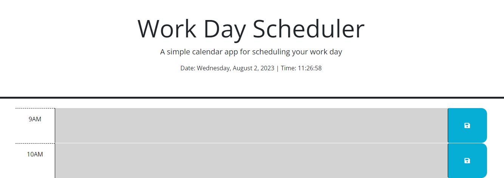
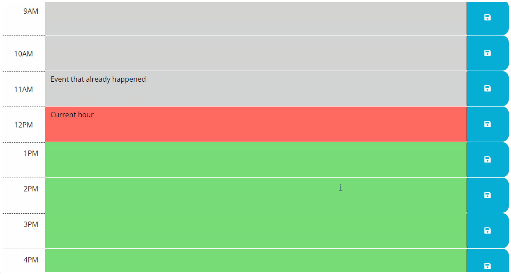

# work-day-schedule-app
This Scheduler was designed to map out a normal work day hour by hour and take user entries to assist in scheduling the day. 
Whenever a user adds a text entry into the corresponding hour and clicks the save button, it will save despite the browser refreshing. 
In addition the app uses real time so at any given point in the day it will display the current date and hour to the second. Visually it will represent the current hour with red, the future with green and the past with grey. 

The following image shows the web application's appearance and functionality: 

Deployed Application : https://nysat.github.io/work-day-schedule-app/

## User Story 
AS AN employee with a busy schedule
I WANT to add important events to a daily planner
SO THAT I can manage my time effectively

## Acceptance Criteria
GIVEN I am using a daily planner to create a schedule
WHEN I open the planner
THEN the current day is displayed at the top of the calendar
WHEN I scroll down
THEN I am presented with timeblocks for standard business hours of 9am - 5pm
WHEN I view the timeblocks for that day
THEN each timeblock is color coded to indicate whether it is in the past, present, or future
WHEN I click into a timeblock
THEN I can enter an event
WHEN I click the save button for that timeblock
THEN the text for that event is saved in local storage
WHEN I refresh the page
THEN the saved events persist

## License

Licensed under the MIT license.